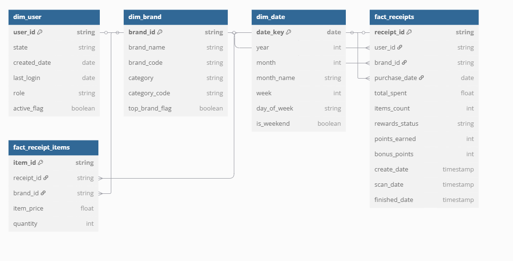

# FETCH-DATA-ENGINEERING

## Overview
This repository contains the data engineering pipeline for processing and analyzing data for the Fetch project. It includes data models, analysis scripts, and quality verification tools.

## Project Structure
```
├── data/
│   ├── brands.json
│   ├── receipts.json
│   └── users.json
├── data-analysis/
│   ├── business_questions_answers.sql
│   └── data_quality_analysis.ipynb
├── data-models/
│   ├── data_model_oltp.sql
│   ├── data_model_star_schema.sql
│   └── star_schema_erd.png
├── Email.eml
└── README.md
```

## Data Models
A star schema design for efficient reporting and analysis by organizing data into fact and dimension tables.




## Data Analysis
SQL queries for business analysis and a Jupyter notebook for data quality verification:
- `business_questions_answers.sql`: Contains queries that answer key business questions
- `data_quality_analysis.ipynb`: Performs data quality checks and validation

## Communication
Important project communications can be found in the `Email.eml` file, which contains a communication to product/business/data leaders explaining data quality issues, addressing questions about the data, and outlining performance and scaling considerations. 